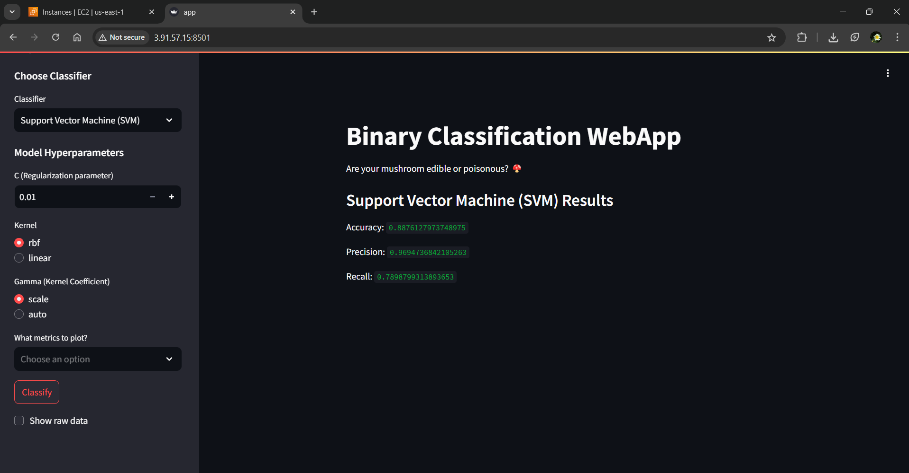

# 🐳 Deploying a Dockerized App on AWS EC2

## Overview  
This guide explains how to set up a **Dockerized application** on an **Amazon Linux 2 EC2 instance**. You'll learn how to install Docker, transfer project files, build an image, and run your application.

---

## 📌 Requirements  
- AWS EC2 instance (Amazon Linux 2)  
- SSH Key Pair (`vs-kp-1.pem`)  
- Docker installed on EC2  
- Required files: `Dockerfile`, `app.py`, `requirements.txt`, `mushrooms.csv`  

---

## 🛠️ Steps to Deploy  

### 1️⃣ Connect to EC2 & Update System  
```sh
ssh -i vs-kp-1.pem ec2-user@<EC2-Public-IP>
sudo yum update -y
```

### 2️⃣ Install Docker & Start the Service  
```sh
sudo amazon-linux-extras enable docker
sudo yum install -y docker
sudo service docker start
sudo usermod -aG docker ec2-user  # Allows running Docker without sudo
```

### 3️⃣ Create a Directory for Your Application  
```sh
mkdir ~/app_files
```

### 4️⃣ Transfer Files from Local Machine to EC2  
```sh
chmod 600 vs-kp-1.pem
scp -i vs-kp-1.pem Dockerfile app.py requirements.txt mushrooms.csv ec2-user@<EC2-Public-IP>:/home/ec2-user/app_files
```

### 5️⃣ Navigate to Directory & Build the Docker Image  
```sh
cd ~/app_files
docker build -t my_app:v1.0 .
```

### 6️⃣ Run the Container  
```sh
docker run -d -p 8501:8501 my_app:v1.0
```

---

## ✅ Verifying Deployment  

📌 **Access the application:**  
```
http://<EC2-Public-IP>:8501
```

📌 **Check running containers:**  
```sh
docker ps
```

📌 **View logs for debugging:**  
```sh
docker logs <container-id>
```

📌 **Stop the container if needed:**  
```sh
docker stop <container-id>
```

### 📸 Application Running Screenshot  
  

---
---

## 🔥 Additional Notes  

- **Ensure your EC2 security group allows inbound traffic on port 8501.**  
- Restart Docker if necessary:  
  ```sh
  sudo service docker restart
  ```  
- If the container crashes, check logs to troubleshoot.  

🚀 **Enjoy your deployed application!** 🚀
