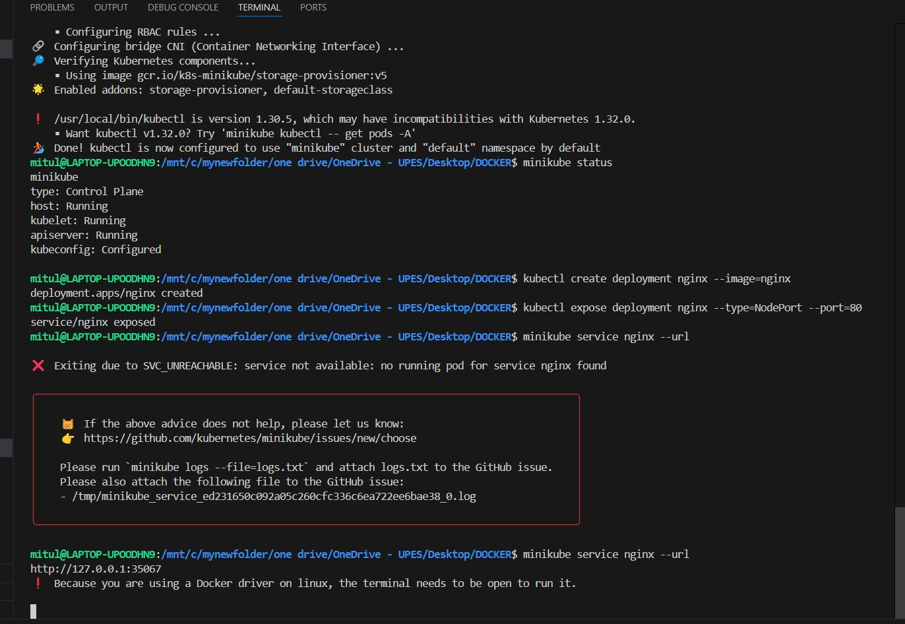
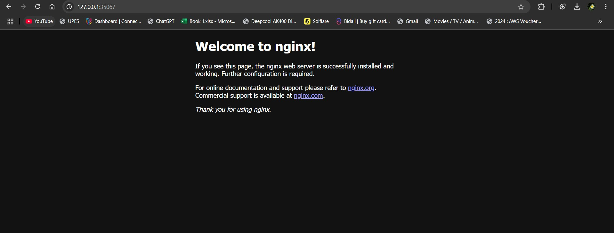

# 🚀 Running Kubernetes Locally with Minikube & Docker 🐳  

Minikube is a lightweight tool that lets you run a **Kubernetes cluster** on your local machine. It’s an ideal way for developers to test, deploy, and manage containerized applications without requiring a cloud provider.  

This guide will help you **set up Minikube with Docker** on Linux and deploy a sample application.  

---

## 📌 Prerequisites  

Before starting, ensure you have the following installed:  

### 🔹 1. Install Docker  

Since Minikube runs Kubernetes inside a Docker container, install and start Docker:  

- [Follow the Docker installation guide](https://docs.docker.com/engine/install/ubuntu/)  
- Start and enable the Docker service:  

```sh
sudo systemctl start docker
sudo systemctl enable docker
```

### 🔹 2. Install Minikube  

Download and install Minikube with the following command:  

```sh
curl -LO https://storage.googleapis.com/minikube/releases/latest/minikube-linux-amd64
sudo install minikube-linux-amd64 /usr/local/bin/minikube
```

### 🔹 3. Install kubectl (Kubernetes CLI)  

```sh
sudo apt install -y kubectl
```
Verify the installation:  
```sh
kubectl version --client
```

---

## 🚀 Setting Up Minikube  

### ✅ Start Minikube  

Ensure Docker is running, then start Minikube using Docker as the driver:  

```sh
minikube start --driver=docker
```

Check its status:  

```sh
minikube status
```

---

## 🌐 Deploying an Application  

### ✅ Deploy an Nginx Web Server  

#### 🔹 1. Create an Nginx Deployment  

```sh
kubectl create deployment nginx --image=nginx
```

#### 🔹 2. Expose the Deployment  

```sh
kubectl expose deployment nginx --type=NodePort --port=80
```

#### 🔹 3. Get the Service URL  

```sh
minikube service nginx --url
```

Open the generated URL in a web browser to see your Nginx server running. 🎉  

---

## ⚙️ Managing the Kubernetes Cluster  

### ✅ View Running Pods  

```sh
kubectl get pods
```

### ✅ Scale the Deployment  

Increase the number of replicas:  

```sh
kubectl scale deployment nginx --replicas=3
```

Verify the updated pods:  

```sh
kubectl get pods
```

### ✅ Delete the Deployment  

```sh
kubectl delete service nginx
kubectl delete deployment nginx
```

---

## ❌ Stopping & Cleaning Up  

### ✅ Stop Minikube  

```sh
minikube stop
```

### ✅ Delete the Cluster  

```sh
minikube delete
```

⚠️ This will remove all Kubernetes resources from your local setup.  

---

## 🎯 Conclusion  

With **Minikube and Docker**, you can easily run a **Kubernetes cluster locally** without needing additional virtualization tools. This setup is great for learning, testing, and running small applications in a Kubernetes environment.  

### 🚀 Next Steps  
- Deploy your own applications using Kubernetes.  
- Explore Kubernetes objects like **ConfigMaps**, **Secrets**, and **Volumes**.  
- Try out **Helm charts** for easier application deployment.  

💙 **Happy Kubernetes-ing!** ♸️  

---

## 📸 Example Outputs  

- **Minikube Running in Terminal**  
    

- **Nginx Web Server Running in Browser**  
    

