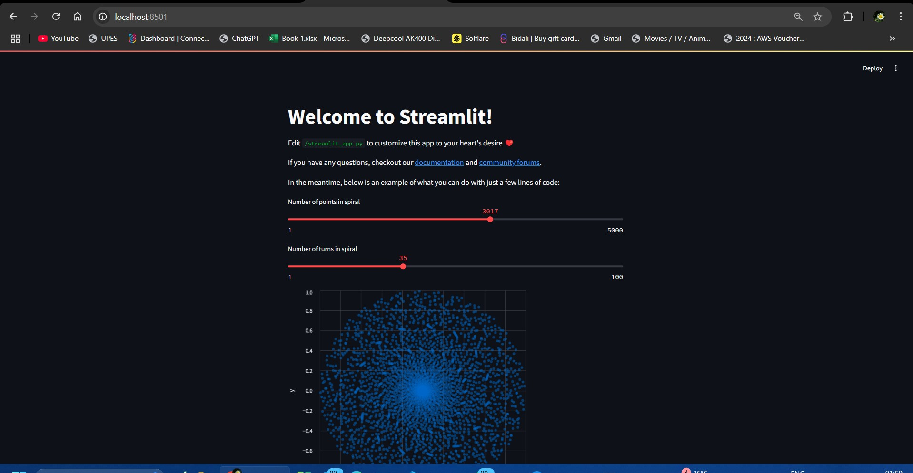

## EXP-1: *Streamlit Spiral Visualization App with Docker*

Welcome to the *Streamlit Spiral Visualization App*! This project is a simple yet interactive Python application built using **Streamlit**, allowing users to visualize and customize a spiral dynamically. With real-time adjustments via sliders, you can modify the spiral’s properties and see immediate changes. To ensure consistency and easy deployment, the app is containerized using Docker.

## 🌟 *Key Features*
- **Interactive Customization**: Modify the number of points and turns in the spiral using sliders.
- **Live Updates**: The spiral visualization updates in real time based on your input.
- **Dockerized for Portability**: The app runs in a Docker container for seamless deployment across environments.

## 🚀 *Technologies Used*
- **Python 3**: The core language behind the application.
- **Streamlit**: A framework for creating interactive web applications.
- **Altair**: Used for rendering the spiral with statistical visualization.
- **Docker**: Ensures the app runs in a consistent environment.
- **Pandas**: Handles data manipulation and processing.

## ⚙ *Prerequisites*
Before running the application, ensure you have the following installed:
- **Docker**: Required for building and running the container.
- **Git**: Needed to clone the repository.

If Docker is not installed, follow the [official installation guide](https://docs.docker.com/get-docker/).

## 🛠 **Getting Started**
Follow these steps to set up and run the application locally or inside a Docker container:

### Step 1: **Clone the Repository**
Run the following command to download the project:

```bash
git clone https://github.com/mitul-2210/MyDocker

cd Docker_Practices
```

### Step 2: **Ensure Dependencies Are Listed**
Make sure the project folder includes a `requirements.txt` file with the following dependencies:

```txt
streamlit
altair
pandas
```

### Step 3: **Build the Docker Image**
Navigate to the project directory and run:

```bash
docker build -t streamlit .
```

This command creates a Docker image named `streamlit` using the provided `Dockerfile`.

#### **Verify Image Creation**
Once the image is built, confirm its existence by:
- **Using Docker Desktop**: Check the **Images** section for `streamlit`.
- **Using CLI**: Run the following command:

  ```bash
  docker images
  ```
  
  If successful, `streamlit` should appear in the list of available images.

### Step 4: **Run the Application in a Container**
Launch the container using:

```bash
docker run -p 8501:8501 streamlit
```

This maps port `8501` inside the container to the same port on your local machine.

### Step 5: **Access the App**
Once the container is running, open your browser and go to:

```
http://localhost:8501
```

Now, you can interactively adjust the spiral visualization in real time.

## 🌀 **App Functionality**

### **User Controls**
- **Number of points**: Defines how many points make up the spiral.
- **Number of turns**: Determines the number of full rotations.

### **Live Visualization**
Changes made through the sliders instantly update the spiral’s appearance.

### **Behind the Scenes**
The app uses mathematical functions to generate spiral points based on polar coordinates. **Altair** then visualizes the data as a scatter plot within Streamlit.

## 🖼 **Example Output**
Below is an example of the running application:



## 💻 **Code Breakdown**
- **Using NamedTuple**: Stores `x` and `y` coordinates for the spiral points.
- **Generating Spiral Data**: Uses polar coordinate formulas to compute positions.
- **Visualizing with Altair**: The processed data is displayed as an interactive plot.

## 🛠 **Troubleshooting Guide**
If you encounter issues, try the following:

1. **Check Logs**: If the container fails, view logs with:
   ```bash
   docker logs <container_id>
   ```

2. **Verify Dependencies**: Ensure the `requirements.txt` file includes all necessary libraries and is properly installed in the Docker image.

## 🤝 **Contributing**
Interested in contributing? Here’s how you can help:
1. Fork the repository.
2. Create a new branch for your modifications.
3. Implement changes and commit them.
4. Push to your forked repo.
5. Submit a pull request.

---

### Happy Coding! 🎉
