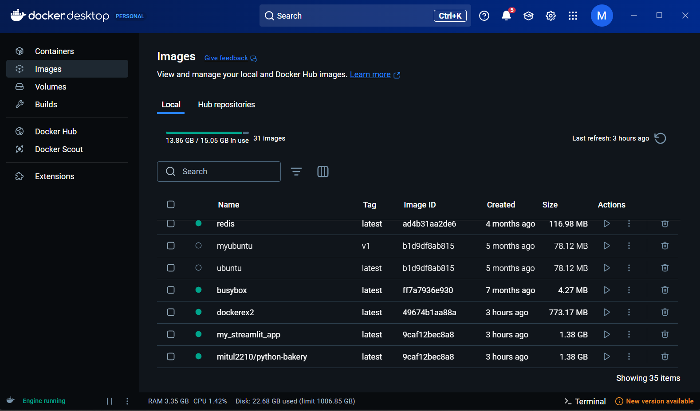
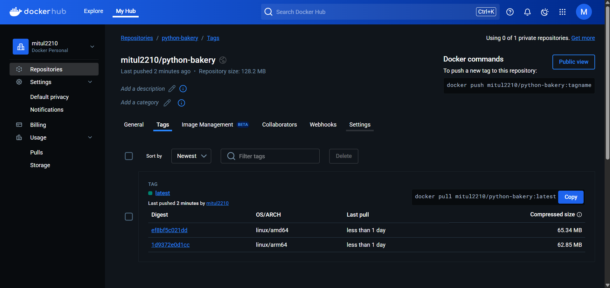

# Optimizing Multi-Platform Docker Builds with Buildx Bake 🏗️🍞

## 📌 Overview

**Docker Bake** is a game-changer for building and managing multi-platform Docker images efficiently. Using **docker buildx bake**, you can define multiple build configurations in a single file and execute them in parallel, making the build process faster and more structured.

In this guide, we'll walk through creating multi-architecture images for **Python 3.9** and pushing them to Docker Hub.

---

## 🚀 Why Use Docker Bake?

- **Faster Builds**: Parallel execution significantly cuts down build time.
- **Cross-Platform Compatibility**: Supports multiple architectures like `x86_64 (AMD64)` and `ARM64`.
- **Unified Configuration**: Manage builds using **HCL, JSON, or YAML** formats.
- **Declarative Setup**: Clearly define build targets for better maintainability.
- **Seamless Deployment**: Push images to Docker Hub in one command.

---

## 🛠 Prerequisites

Before you begin, ensure the following are installed:

- Docker (v20.10 or later)
- Docker Buildx
- A Docker Hub account

Verify installation by running:

```bash
docker --version
docker buildx version
```

---

## 📂 Directory Structure

Your project should be organized as follows:

```bash
.
├── Dockerfile
├── docker-bake.hcl
└── README.md
```

---

## 🧑‍💻 Step 1: Create the Dockerfile

This `Dockerfile` will set up a lightweight Python 3.9 environment:

```Dockerfile
# Use Ubuntu 20.04 as the base image
FROM ubuntu:20.04

# Install Python 3.9 and required dependencies
RUN apt-get update && apt-get install -y \
    python3.9 python3.9-venv python3.9-dev \
    && rm -rf /var/lib/apt/lists/*

CMD ["python3"]
```

---

## 🏗 Step 2: Define Build Configuration

Create a `docker-bake.hcl` file to specify build targets:

```hcl
# docker-bake.hcl

group "default" {
    targets = ["python-bakery"]
}

target "python-bakery" {
    context    = "."
    dockerfile = "Dockerfile"
    platforms  = ["linux/amd64", "linux/arm64"]
    tags       = ["yourusername/python-bakery:latest"]
}
```

> 🔹 Replace `yourusername` with your actual Docker Hub username.

---

## 🚀 Step 3: Build and Push Images

1️⃣ **Log in to Docker Hub**:

```bash
docker login
```

2️⃣ **Execute the build and push process**:

```bash
docker buildx bake --push
```

✅ This will generate Python 3.9 images for `AMD64` and `ARM64` and upload them to your Docker Hub repository.

---

## 📦 Checking Your Images on Docker Hub

After pushing, you can view your images by navigating to:

```
https://hub.docker.com/repository/docker/yourusername/python-bakery/general
```

You'll find all available architectures listed under the **Tags** section.

---

## 📸 Sample Screenshots

### Docker Hub Repository View



### Multi-Platform Image Tags



---

## 🎯 Final Thoughts

Docker Bake makes multi-platform image building more efficient and manageable. With just a few configuration tweaks, you can automate and accelerate the process.

🔹 **Next Steps:**
- Experiment by adding new build targets.
- Explore build caching to speed up the process.
- Integrate this workflow into your **CI/CD pipeline** for automation.

🎉 **Happy Dockerizing!** 🐳

