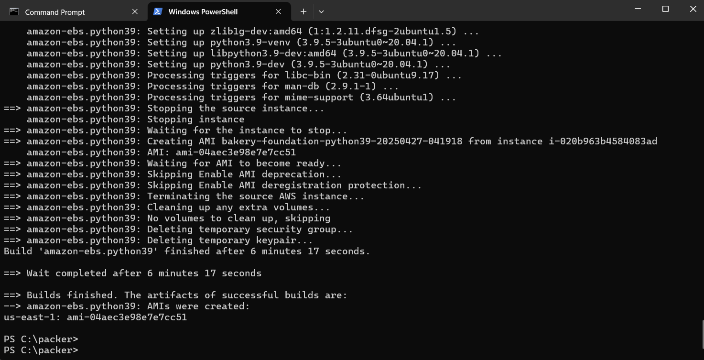
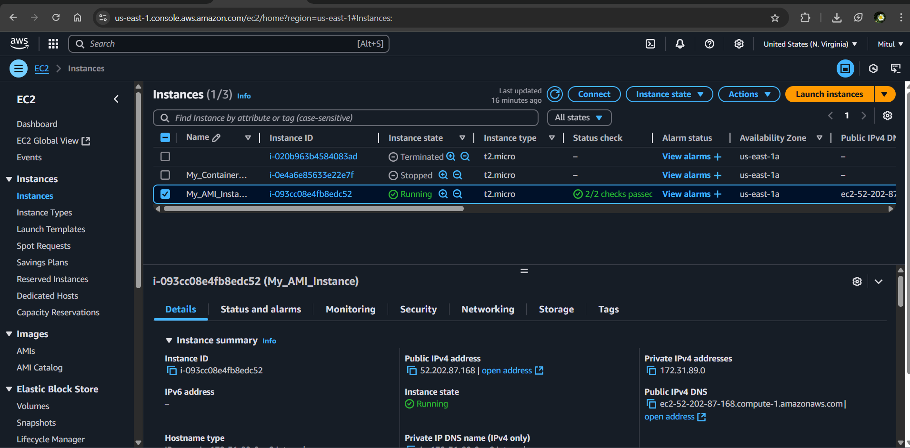

# Setting Up a Bakery Foundation AMI on Windows 🍞

## Introduction

This guide walks you through the process of using **Packer** to create a custom Amazon Machine Image (AMI) on AWS. It includes installation, configuration, and deployment instructions specifically for Windows users.

## Requirements

Before getting started, ensure you have:

- A **Windows** system with administrator privileges.
- An active **AWS account** with appropriate IAM credentials.
- Basic familiarity with AWS and PowerShell.

---

## Step 1: Installing Necessary Tools

### 1.1 Installing Packer

#### Step 1: Downloading Packer  
1. Visit the **[Packer Download Page](https://www.packer.io/downloads)**.  
2. Download the **Windows (64-bit) ZIP file**.  

#### Step 2: Extracting Packer  
1. Locate the downloaded ZIP file.  
2. Right-click and select **Extract All...**  
3. Move `packer.exe` to `C:\packer` (Create this directory if it doesn’t exist).  

#### Step 3: Adding Packer to System PATH  
1. Open **Environment Variables** from Windows search.  
2. Under **System Variables**, locate `Path` and click **Edit**.  
3. Click **New** and add:  
   ```
   C:\packer
   ```  
4. Click **OK** to apply changes.  

#### Step 4: Verifying Installation  
Launch PowerShell and enter:

```powershell
packer --version
```

✅ If installed correctly, the **Packer version** will be displayed.

---

### 1.2 Installing AWS CLI

#### Step 1: Download and Install AWS CLI  
1. Visit the **[AWS CLI Download Page](https://aws.amazon.com/cli/)**.  
2. Download and run the `AWSCLI.msi` installer.  

#### Step 2: Verify Installation  
Run:

```powershell
aws --version
```

✅ Expected output: `aws-cli/2.x.x Windows/10`.

---

### 1.3 Configuring AWS CLI  
Run the following command in PowerShell:

```powershell
aws configure
```

Provide the following details:
- **AWS Access Key ID**: `<Your AWS Key>`  
- **AWS Secret Access Key**: `<Your AWS Secret>`  
- **Default region**: `us-east-1` (or your preferred region)  
- **Default output format**: `json` (Press Enter)  

✅ AWS CLI is now configured.

---

## Step 2: Creating the Packer Template

### 2.1 Writing the Packer Configuration File

1. Open **Notepad** or **VS Code**.
2. Copy and paste the following configuration:

```hcl
packer {
  required_plugins {
    amazon = {
      source  = "github.com/hashicorp/amazon"
      version = ">= 1.0.0"
    }
  }
}

variable "aws_region" {
  default = "us-east-1"
}

source "amazon-ebs" "python39" {
  ami_name      = "bakery-foundation-python39-${formatdate("YYYYMMDD-HHmmss", timestamp())}"
  instance_type = "t2.micro"
  region        = var.aws_region
  source_ami    = "ami-0a25f237e97fa2b5e"
  ssh_username  = "ubuntu"
}

build {
  sources = ["source.amazon-ebs.python39"]

  provisioner "shell" {
    inline = [
      "sudo apt-get update",
      "sudo apt-get install -y python3.9 python3.9-venv python3.9-dev"
    ]
  }
}
```

3. Save the file as `bakery.pkr.hcl` in `C:\packer`.

---

### 2.2 Identifying the Correct Ubuntu AMI

Run the following command in PowerShell to get the latest Ubuntu AMI:

```powershell
aws ec2 describe-images --owners 099720109477 --filters "Name=name,Values=ubuntu/images/hvm-ssd/ubuntu-focal-20.04-amd64-server-*" --query "Images | sort_by(@, &CreationDate)[-1].ImageId" --output text
```

✅ Replace `source_ami` in `bakery.pkr.hcl` with the retrieved AMI ID.

---

## Step 3: Validating and Building the AMI

### 3.1 Initializing and Validating Packer

Navigate to `C:\packer` in PowerShell:

```powershell
cd C:\packer
```

Initialize Packer:

```powershell
packer init .
```

Validate the configuration:

```powershell
packer validate bakery.pkr.hcl
```

✅ Expected output: Configuration is valid.

---

### 3.2 Building the AMI

Run:

```powershell
packer build bakery.pkr.hcl
```

Packer will:
- Launch a **temporary EC2 instance**.
- Install **Python 3.9**.
- Convert the instance into an **Amazon Machine Image (AMI)**.
- Terminate the temporary instance.

---

## Step 4: Deploying and Testing the AMI

### 4.1 Locating the AMI

1. Log in to **AWS Console**.
2. Go to **EC2 → AMIs** and select your region.
3. Look for the AMI with the name `bakery-foundation-python39-<timestamp>`.

---

### 4.2 Launching an EC2 Instance

1. Open the **[AWS EC2 Console](https://console.aws.amazon.com/ec2)**.
2. Click **Launch Instance** → **My AMIs**.
3. Select your AMI and configure:
   - **Instance Type**: `t2.micro` (or higher).
   - **Key Pair**: Choose an existing key or create a new one.
   - **Security Group**: Allow **SSH (port 22)** and other necessary ports.
4. Click **Launch**.

---

### 4.3 Confirming Python Installation

Once the instance is running, connect via SSH and execute:

```bash
python3.9 --version
```

✅ Expected output:

```bash
Python 3.9.21
```

## 📸 Result Screenshots

### 1. AMI Created Successfully

After running the `packer build` command, you should see an output similar to the following:

```bash
==> Builds finished. The artifacts of successful builds are:
--> amazon-ebs.python39: AMIs were created:
us-east-1: ami-xxxxxxxxxxxxxxxxx

```


This indicates that the AMI has been successfully created and is ready for use.

**Screenshot: AMI Created Successfully**


(img3.png)
---

### 2. Running EC2 Instance with Python 3.9

After launching the EC2 instance and connecting via SSH, running the command:

```bash
python3.9 --version
```

Should return:

```bash
Python 3.9.21
```

This confirms that Python 3.9 has been successfully installed on the instance.

**Screenshot: Python 3.9 Installed on EC2 Instance**


(img2.png)

---

---

## Conclusion

You have successfully:
- Installed **Packer** and **AWS CLI**.
- Created a **custom AMI** with **Python 3.9**.
- Deployed an EC2 instance from the AMI.

🎉 Your cloud-based Bakery Foundation setup is now complete! 🚀

