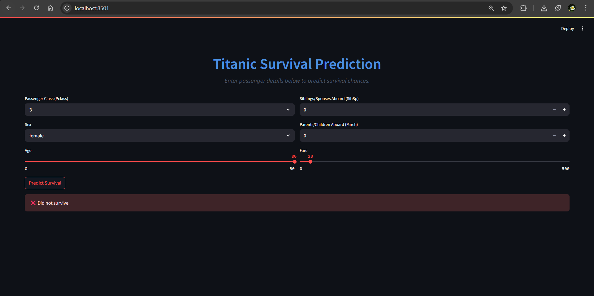
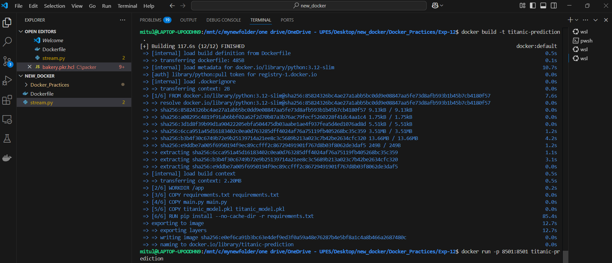

# 🚢 Titanic Survival Predictor - Streamlit App in a Docker Container

## 📌 About the Project
This project predicts whether a Titanic passenger would have survived the tragedy, using a machine learning model built with **Python**, **scikit-learn**, **pandas**, and **Streamlit** for the web app interface.  
For easier deployment and portability across systems, the app is fully **containerized using Docker**.

---

## 🗂️ Project Layout
```
Titanic-Prediction/
├── Dockerfile             # Instructions to build the container
├── requirements.txt       # Python dependencies
├── main.py                # Streamlit application code
├── titanic_model.py       # Model building and preprocessing
├── titanic_model.pkl      # Pre-trained ML model
```

---

## 🧠 How the Machine Learning Model Works (titanic_model.py)
The model uses a **Random Forest Classifier** trained on Titanic passenger data. After training, it’s saved as **titanic_model.pkl** using `joblib` for quick loading in the app.

### 🚶 Workflow inside `titanic_model.py`:
- Load the Titanic dataset.
- Clean and preprocess data (handle missing values, encode categories).
- Train the Random Forest model.
- Save the trained model for later predictions.

---

## 🎨 Streamlit Frontend (main.py)
The **Streamlit app** provides a smooth and interactive UI where users can enter passenger information and get instant survival predictions.

### ✨ Key Highlights:
- ✅ Clean and intuitive design
- ✅ Instant prediction results based on inputs
- ✅ Use of sliders, dropdowns, and forms for user-friendly interactions

---

## 🐳 Dockerizing the Application
The app is wrapped inside a **Docker container** to make it easy to run on any machine without worrying about dependencies.

### 📄 Dockerfile Breakdown:
```dockerfile
FROM python:3.12-slim
WORKDIR /app
COPY requirements.txt requirements.txt
COPY main.py main.py
COPY titanic_model.pkl titanic_model.pkl
RUN pip install --no-cache-dir -r requirements.txt
EXPOSE 8501
CMD ["streamlit", "run", "main.py", "--server.port=8501", "--server.address=0.0.0.0"]
```

---

## 🚀 Running the App with Docker

### Step 1: Navigate to the Project Folder
```bash
cd Titanic-Prediction
```

### Step 2: Build the Docker Image
```bash
docker build -t titanic-prediction .
```

### Step 3: Launch the Container
```bash
docker run -p 8501:8501 titanic-prediction
```

### Step 4: View the App
Open your browser and go to:
```
http://localhost:8501
```

---

## ☁️ Hosting on the Cloud
You can also deploy this containerized app on platforms like **AWS**, **GCP**, or **Azure**:

- **AWS**: Deploy via Elastic Container Service (ECS) or EC2.
- **Google Cloud**: Push your image to Google Container Registry (GCR) and deploy with Cloud Run.
- **Azure**: Use Azure Container Instances (ACI) or Kubernetes Service (AKS).

---

## 🔧 Handy Docker Commands

- **Stop a running container**:
```bash
docker stop <container-id>
```
- **Remove a container**:
```bash
docker rm <container-id>
```
- **Delete an image**:
```bash
docker rmi titanic-prediction
```

---

## 📸 Sample Output





---

## 🎯 Wrapping Up
This project brings together machine learning, a web-based frontend, and containerization to create a portable Titanic survival predictor.  
The **Dockerized app** ensures smooth deployment, while the **Streamlit UI** makes it accessible for everyone.

### 🚀 Future Enhancements:
- ✅ Cloud deployment to AWS/GCP/Azure
- ✅ Add more visualizations and UI improvements
- ✅ Tune the model for even better prediction accuracy

💬 Thanks for checking out the project — Happy coding and containerizing! 🐳🚢
