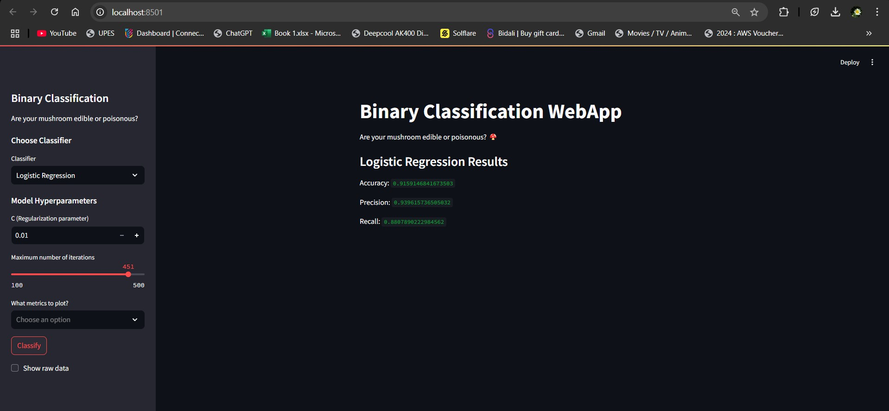

# Docker Experiment 2: Binary Classification WebApp with Streamlit

Welcome to **Docker Experiment 2**! This project showcases the use of **Docker** to containerize a **machine learning web application** built with **Streamlit**. The app predicts whether a mushroom is **edible** or **poisonous** based on input features, using machine learning classifiers.

---

## 🚀 Project Overview

This is a **Binary Classification WebApp** that leverages machine learning to determine the edibility of mushrooms. It allows users to select from different classifiers, including **Support Vector Machine (SVM)**, **Logistic Regression**, and **Random Forest**.

### Key Features:
- **User-Friendly Interface**: A simple and interactive UI built with **Streamlit**.
- **Multiple Classification Models**: Choose from **SVM**, **Logistic Regression**, and **Random Forest**.
- **Performance Metrics**: Visualize key metrics such as **Confusion Matrix**, **ROC Curve**, and **Precision-Recall Curve**.
- **Dockerized Deployment**: Ensures portability and consistency across environments.

---

## 📝 Prerequisites

Ensure the following dependencies are installed before proceeding:

- **Docker**: [Install Docker](https://www.docker.com/get-started)
- **Docker Compose**: Required for managing multi-container applications.

---

## 📂 Project Structure

```plaintext
/Docker_Practices
├── /Exp-2
    ├── Dockerfile                 # Defines the container image
    ├── docker-compose.yml         # Configuration file for Docker Compose
    ├── app.py                     # Streamlit application for classification
    ├── requirements.txt           # Lists required Python packages
    ├── mushrooms.csv              # Dataset used for classification
```

---

## 🚀 Running the Application

Follow these steps to set up and launch the app in a Docker environment:

### Step 1: Clone the Repository

Clone the repository to your local machine:

```bash
git clone https://github.com/Aditya5757raj/Docker_Practices.git
cd Docker_Practices/Exp-2
```

### Step 2: Build the Docker Image

Run the following command to build the image:

```bash
docker-compose build
```

This will create a container image based on the **Dockerfile**.

### Step 3: Run the Application in a Docker Container

Start the application by executing:

```bash
docker-compose up
```

Once running, access the app by visiting http://localhost:8501 in your web browser.

### Step 4: Interacting with the App

- Choose a classification model from the sidebar (SVM, Logistic Regression, or Random Forest).
- Adjust hyperparameters and select evaluation metrics.
- Click **Classify** to generate predictions and view performance metrics.

### Step 5: Stopping the Application

To stop the container and shut down the app, use:

```bash
docker-compose down
```

---

## 🖼️ Sample Output

Below is an example of the classification results:



This visual displays the confusion matrix, ROC curve, and precision-recall curve for a classification task.

---

## 🤝 Contributing

Contributions are welcome! To contribute:

1. Fork the repository.
2. Create a new branch.
3. Implement changes and commit them.
4. Push to your fork and submit a pull request.

For issues or feature requests, open an issue on GitHub.

---

### Happy Coding! 🎉

