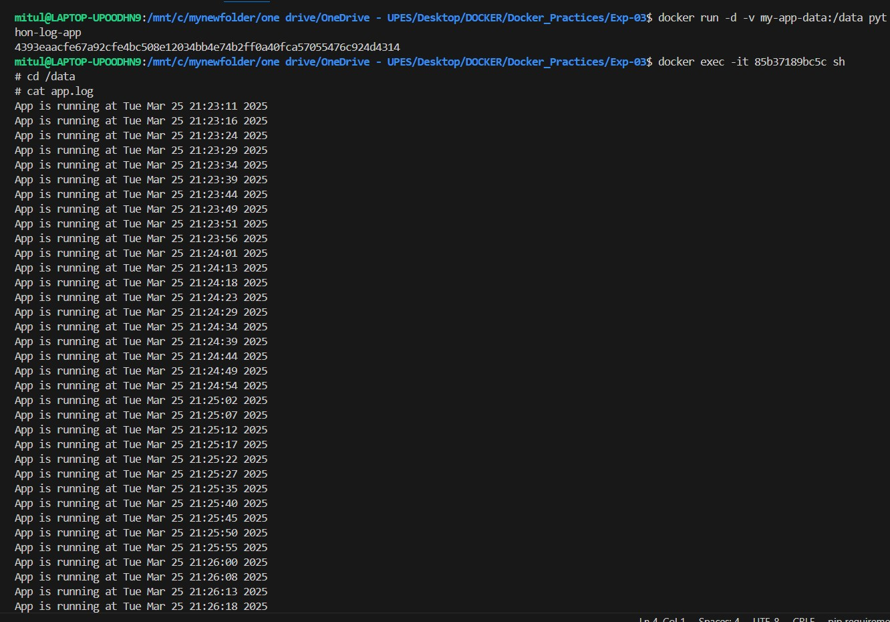
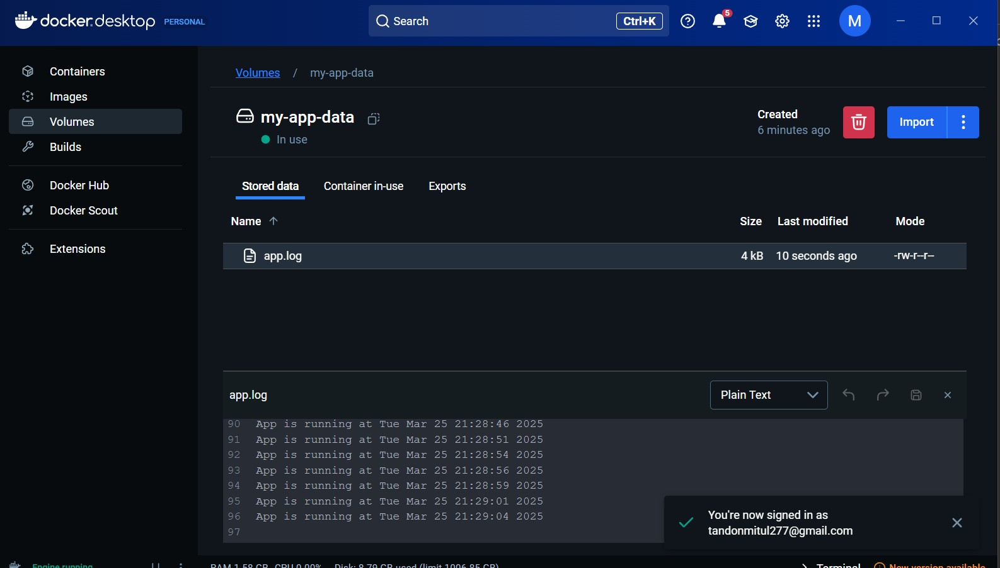

# 🐍 Python Logging Application with Docker

This project demonstrates how to build a **Python logging application** that continuously writes logs to a file while running inside a **Docker container**. The logs are stored in a **Docker volume**, ensuring they persist even if the container is stopped or removed.

---

## 📂 Project Structure

```
.
├── app.py        # Python script for logging
└── Dockerfile    # Configuration file to build the Docker image
```

---

## 🔧 Prerequisites

Ensure you have Docker installed on your system:

[🔗 Download Docker](https://docs.docker.com/get-docker/)

---

## 🛠️ Setting Up the Project

### ✍️ Step 1: Create the Python Logging Script

Create a file named **`app.py`**, then insert the following code:

```python
import time

# Open or create the log file and continuously append new entries
with open("/data/app.log", "a") as log_file:
    while True:
        log_file.write(f"Application is running at {time.ctime()}\n")
        log_file.flush()  # Ensures data is written immediately
        time.sleep(5)     # Logs an entry every 5 seconds
```

This script continuously logs the current timestamp into **`/data/app.log`**.

---

### 🛠️ Step 2: Create the Dockerfile

Create a **`Dockerfile`** in the same directory and add the following content:

```dockerfile
# Use a minimal Python image
FROM python:3.9-slim

# Set up the working directory inside the container
WORKDIR /app

# Copy the Python script into the container
COPY app.py /app/app.py

# Define the command to execute when the container starts
CMD ["python", "app.py"]
```

This configuration ensures that the Python logging script runs automatically inside the container.

---

## 🚀 Building and Running the Docker Container

### 📦 Step 3: Build the Docker Image

Run the following command to build the image:

```bash
docker build -t python-logger .
```

This creates a Docker image named **`python-logger`**.

---

### ▶️ Step 4: Run the Container with a Persistent Volume

To maintain log files across container restarts, execute:

```bash
docker run -d -v log-data:/data python-logger
```

📌 **Explanation:**
- `-d` → Runs the container in the background (detached mode).
- `-v log-data:/data` → Mounts a persistent volume named **`log-data`** to store logs.

---

## 🔍 Checking Logs

### ✅ Verify if the container is running:
```bash
docker ps
```

### 📜 View logs directly from the container:
```bash
docker logs <container-id>
```
*(Replace `<container-id>` with the actual container ID from `docker ps`.)*

### 📂 Access logs inside the container:
```bash
docker exec -it <container-id> sh
cd /data
cat app.log
```

### 🔎 Inspect the Docker volume:
```bash
docker volume inspect log-data
```

---
## 🪚 Results

Here are sample terminal outputs showing logging details:

### Image 1: Container Logs in Real-time


### Image 2: Viewing Log File from Docker Volume


---

---

## 📌 Cleaning Up

If you need to stop and remove everything, use these commands:

### ❌ Stop the container:
```bash
docker stop <container-id>
```

### 🗑️ Remove the container:
```bash
docker rm <container-id>
```

### 🗑️ Remove the image (if needed):
```bash
docker rmi python-logger
```

### 🗑️ Delete the volume (optional):
```bash
docker volume rm log-data
```

---

## 🚀 Key Takeaways

- **Docker volumes** ensure that logs persist even if the container is removed.
- You can **monitor logs in real time** using `docker logs` or by accessing the `/data` directory.
- This approach is ideal for **debugging, monitoring, and application tracking** in containerized environments.

---

## 🎉 Keep Logging with Docker! 🚀

This setup provides a solid foundation for logging within Docker containers. You can further enhance it by implementing **log rotation**, **cloud storage integration**, or **monitoring tools** like ELK Stack or Prometheus.
