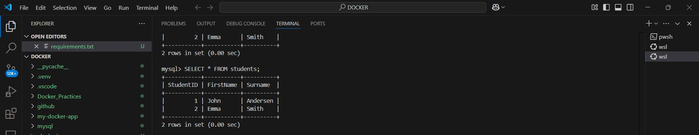

_____

# 🐳 MySQL Docker Container  

This repository contains a **Docker setup** for running a **MySQL container** with an initial database setup.  

## 📌 Features  
👉 **Pre-configured MySQL Database** – Automatically sets up a MySQL instance.  
👉 **Database Initialization** – Runs `database.sql` on the first startup.  
👉 **Easy Setup & Deployment** – Simple commands to build and run.  

---

## 🛠️ Setup Instructions  

### 1️⃣ Clone the Repository & Navigate to the Directory  
```sh
git clone https://github.com/Aditya5757raj/Docker_Practices.git
cd Docker_Practices
```

### 2️⃣ Build the Docker Image  
Run the following command to **build** the MySQL image:  
```sh
docker build -t mysql-container .
```

### 3️⃣ Run the Container  
Start a **MySQL container** using the built image:  
```sh
docker run --name mysql-container -d mysql-container
```

### 4️⃣ Connect to MySQL  
Access the MySQL shell inside the container:  
```sh
docker exec -it mysql-container mysql -u root -p
```
🧙‍♂️ Enter the **root password** (`root`) when prompted.  

### 5️⃣ Stop and Remove the Container  
To **stop** the running container:  
```sh
docker stop mysql-container
```
To **remove** the container:  
```sh
docker rm mysql-container
```

---

## 👤 Result

Check the database result using the following image:  


---

## 📂 Project Structure  

```
Docker_Practices/
│── database.sql  # SQL script for database initialization
│── Dockerfile    # Docker configuration file
│── README.md     # Project documentation
```

## 📌 Notes  
- The `database.sql` file will be executed **only on the first run** to initialize the database.  
- The **root password** is set to `root` (change this in production for security).  

## 🔗 Repository Link  
🔗 **GitHub:** [Aditya5757raj/Docker_Practices](https://github.com/Aditya5757raj/Docker_Practices)  

---

### 📜 License  
This project is **open-source** and available for modification. Feel free to contribute! 🚀

